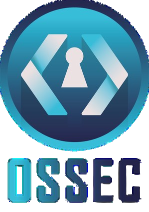

# Hi there, we are OSSEC! (Open Source software ENSI Club)  💙 

 

We are the **cybersecurity-focused** student club of ENSI, La Manouba, Tunisia. We promote open-source culture among engineering students through knowledge sharing, workshops hands-on training and CTFs. We organize **TuniHack**, Tunisia's leading student hackathon.

 

---

## 🔒 What We Do

- 💎 **TuniHack** – our flagship annual hackathon, open to students across Tunisia
- 🔒 **Cybersecurity Workshops** – ethical hacking, penetration testing, network security, and more
- 🔵 **CTF Challenges** – capture-the-flag events to sharpen practical security skills
- 💻 **Open Source Training** – programming, tools, and collaborative dev practices
- 🎙️ **Tech Talks** – sessions led by students, alumni, and industry professionals
- 📘 **Project Mentorship** – we guide students through their personal projects in cybersecurity from idea to execution.

## 🧭 Why Join Us?

Whether you're a beginner curious about security or already diving into CTFs, OSSEC is a space to:

- Learn by doing, not just theory
- Get guidance and mentorship on your own projects from experienced members
- Build a strong foundation before entering the professional world
- Meet like-minded students and grow a network in tech & security
- Contribute to open-source projects and club initiatives

---

<i>Dare to share .</i> 💙🔒

